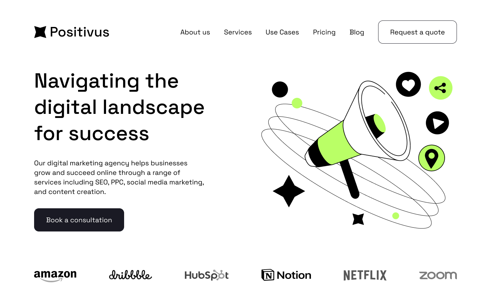

# Positivus



A professional, responsive landing page for a digital marketing agency, crafted with pure semantic HTML5 and a modular SCSS architecture. Positivus showcases services like SEO and social media marketing, emphasizing clean code, accessibility, and maintainability through a strictly component-based approach without any external JavaScript dependencies.

## 🚀 Key Features

*   **Semantic HTML5**: Uses proper semantic tags (`<header>`, `<main>`, `<section>`, `<dialog>`) for optimal accessibility and search engine optimization.
*   **Modular SCSS Architecture**: Styles are organized logically (base, components, layout, helpers) following the 7-1 pattern and best practices for scalability.
*   **BEM Methodology**: CSS classes follow the Block Element Modifier (BEM) convention, ensuring robust and maintainable stylesheets.
*   **Responsive Design**: Fully responsive layout adapting seamlessly from mobile to desktop screens using custom media queries and modern CSS techniques.
*   **Zero Dependencies**: Built without JavaScript frameworks or libraries—focusing on the power of modern HTML and CSS.
*   **Performance Optimized**: Usage of SVG for icons and illustrations ensures crisp rendering on high-DPI screens and ultra-fast load times.

## 🛠 Tech Stack

*   **HTML5**: Core semantic structure.
*   **SCSS (Sass)**: Advanced CSS preprocessor for modular styling, variables, mixins, and nesting.
*   **NPM**: Dependency management for build tools (Sass compiler).

## 📂 Project Structure

```bash
positivus/
├── src/
│   ├── assets/              # Static assets
│   │   ├── favicon/         # Favicons (light/dark mode)
│   │   ├── fonts/           # Local font files (Space Grotesk)
│   │   ├── icons/           # SVG icons and logos
│   │   ├── illustrations/   # Hero and section illustrations
│   │   └── preview.jpg      # Project preview image
│   ├── styles/
│   │   ├── css/             # Compiled CSS files
│   │   └── scss/            # Source SCSS files
│   │       ├── base/        # Global styles, fonts, reset
│   │       ├── components/  # Reusable UI components (buttons, etc.)
│   │       ├── helpers/     # Mixins, variables, media queries
│   │       ├── layout/      # Layout-specific styles (header, hero)
│   │       ├── utils/       # Utility classes
│   │       └── main.scss    # Main entry point
│   └── index.html           # Main HTML file
├── package.json             # Project dependencies and scripts
└── README.md                # Project documentation
```

## 🔧 Installation & Usage

### Prerequisites

Ensure you have [Node.js](https://nodejs.org/) installed on your machine to manage the build tools.

### Installation

1.  **Clone the repository:**
    ```bash
    git clone https://github.com/sabyrkazen/positivus.git
    cd positivus
    ```

2.  **Install development dependencies:**
    ```bash
    npm install
    ```

### Development

To start the Sass compiler in watch mode (updates CSS automatically on file changes):

```bash
npm run sass
```

### Production Build

To compile and minify the CSS for production:

```bash
npm run sass:build
```

### Viewing the Project

After compiling the stylesheets, open the `src/index.html` file in your preferred web browser.

## 🎨 Styles & Theming

The project relies heavily on SCSS for styling. The entry point is `src/styles/scss/main.scss`.

*   **Variables**: Global design tokens (colors, fonts, spacing) are defined in `src/styles/scss/helpers/_variables.scss`.
*   **Media Queries**: Responsive breakpoints (`mobile`, `tablet`, `desktop`) are managed in `src/styles/scss/helpers/_media.scss`.
*   **Components**: Reusable blocks like buttons and cards are located in `src/styles/scss/components/`.

## 📜 License

This project is licensed under the ISC License.

